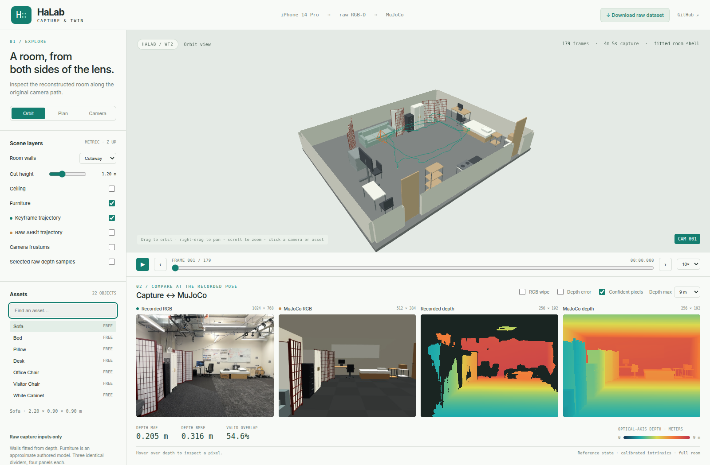

# HaLab clone

An interactive MuJoCo scene and web comparison viewer built from an iPhone 14 Pro's original RGB-D capture.

**[Open the web demo](https://whitealex95.github.io/halab-clone/)** · **[Download the raw dataset](https://github.com/whitealex95/halab-clone/releases/latest/download/halab-raw-dataset.zip)** · [Dataset format](DATASET.md)



The demo includes:

- A room shell fitted directly to raw depth measurements, with wall/ceiling visibility and cutaway controls.
- 22 authored assets, including three identical dividers with four panels and three hinges each.
- All 179 recorded camera poses and a separate trajectory containing 14,811 raw ARKit tracking poses.
- Synchronized original RGB-D versus MuJoCo renders at the recorded pose and intrinsics.
- RGB wipe comparison, shared metric depth colors, confidence masking, absolute depth errors, and pixel inspection.
- Timestamp-based trajectory playback, a calibrated camera view, asset selection, and raw depth samples from the selected frame.

The web app is a visualization of the reference scene. It does not run physics in the browser. Use the native MuJoCo viewer to move furniture and articulate doors, drawers, and divider panels.

## Run locally

```bash
git clone https://github.com/whitealex95/halab-clone.git
cd halab-clone
python mujoco_scene/serve_web.py
```

Open **http://127.0.0.1:8765**. All JavaScript libraries and visualization data are included; no external CDN or backend service is needed. The raw archive is not required just to view the demo.

For physical interaction:

```bash
python -m pip install -r mujoco_scene/requirements.txt
python mujoco_scene/launch.py
```

Double-click an object, then Ctrl + right-drag to pull it or Ctrl + left-drag to rotate it. Space pauses and Backspace resets. [Full MuJoCo instructions](mujoco_scene/README.md).

## Raw dataset

The release archive contains all **983 original capture files**: RGB, depth, confidence, intrinsics/poses, ARKit motion, inertial motion, anchor updates, and location metadata. SHA-256 checksums are included and the release provides an archive checksum. See [DATASET.md](DATASET.md).

The original raw files remain unchanged. Prebuilt meshes, object detections/RoomPlan, Gaussian splats, generated point clouds, and rendered scan videos were removed and are not used. The raw dataset is distributed as a GitHub Release asset; the browser's recorded/rendered comparison data is included in the repository.

## Rebuild from raw inputs

Download and unzip the dataset in this repository root, preserving `Polycam_HaLab_WT2_gpt/Images/keyframes/`.

```bash
python mujoco_scene/scripts/measure_raw.py
python mujoco_scene/scripts/reconstruct_walls.py
python mujoco_scene/scripts/build_scene.py
MUJOCO_GL=egl python mujoco_scene/scripts/validate_scene.py
MUJOCO_GL=egl python mujoco_scene/scripts/export_web.py
python mujoco_scene/scripts/validate_web_data.py
```

MuJoCo and EGL/OpenGL are required for rendering; they are not required to serve the precomputed web demo. The renderer exports optical-axis depth in millimeters at the native 256 × 192 depth resolution. RGB renders are 512 × 384; original RGB is preserved at 1024 × 768. Intrinsics are scaled consistently, including the principal point. Depth multisampling is disabled so each depth pixel corresponds to its center ray.

## Validation and limits

- Ten seconds of simulation with no significant initial intersections or MuJoCo warnings, plus force-response tests for furniture, doors, drawers, and all nine divider hinges.
- Original RGB/depth copies and all 983 raw source files checked for integrity.
- Camera rotations and all 179 paired outputs checked.
- Independent ray-versus-render depth tests across five camera poses: median discrepancies below 0.3 mm, within the exported millimeter quantization.
- Desktop/mobile browser tests cover timeline playback, rapid frame changes, camera view, depth masks, RGB wipe, error visualization, and asset selection.

Reports: [physics](mujoco_scene/validation.json), [RGB-D calibration](mujoco_scene/web_validation.json), [browser](mujoco_scene/browser_validation.json), [wall fitting](mujoco_scene/walls.json).

Walls use robust planar fits; unseen spans and a level ceiling are extrapolated. Wall thickness, doorway details, furniture geometry, masses, and friction are estimates. The scene is an authored approximation, not photorealistic ground truth. The mean of per-frame confident-depth MAEs is approximately 0.176 m for this revision; the browser reports each frame's actual metrics. Missing small objects and simplified shapes contribute to those differences. Divider bases are anchored in the simulation while their remaining panels articulate.

Browser tests can be rerun with:

```bash
npm ci
npx playwright install chromium --only-shell
npm run test:web
```

The local web server must be running. Set `DEMO_URL` to test another deployment.

## Publishing

GitHub Actions publishes `mujoco_scene/web/` to GitHub Pages on pushes to `main`. To package the original dataset, run `python mujoco_scene/scripts/package_dataset.py`; upload the resulting archive and checksum as release assets. The web demo and README link to the latest release.

The exploration/comparison layout was inspired by [Lab kitchen twin](https://frank-zy-dou.github.io/kitchen-twin/). Rendering and interaction use [MuJoCo](https://mujoco.readthedocs.io/) and [Three.js](https://threejs.org/); the vendored Three.js license is included in `mujoco_scene/web/vendor/THREE-LICENSE.txt`.
