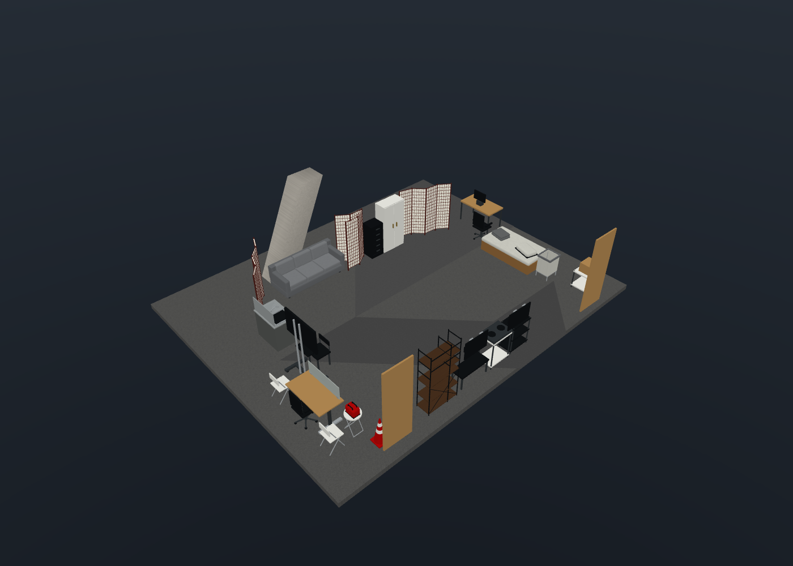

# HaLab MuJoCo scene

The scene uses the original RGB photographs, per-frame depth/confidence maps, and camera poses in `../Polycam_HaLab_WT2_gpt/Images/keyframes/`. Furniture is manually interpreted from those photographs and the separately supplied cabinet/desk reference photos, using editable primitives and procedural meshes. Dimensions, placements, and physical parameters remain estimates.

There are **three copies of the same divider design**: each has **four panels and three hinges**, for **12 panels and nine divider hinges** total. All panels are 0.46 m wide and 1.80 m high, with six columns and 15 rows of lattice cells on both faces, following frame 44. Each copy has its own starting pose and fold angles. The center divider starts folded back on itself; its concealed panels are still present and can unfold.



## Web comparison

Run `python mujoco_scene/serve_web.py` and open http://127.0.0.1:8765, or use the [public demo](https://whitealex95.github.io/halab-twin/). It shows all recorded camera poses, the raw ARKit trajectory, and original RGB-D alongside calibrated MuJoCo renders. See the [repository README](../README.md) for exporting and validation. The [raw dataset](https://github.com/whitealex95/halab-twin/releases/latest/download/halab-raw-dataset.zip) is downloadable separately.

## Run

From `~/Projects/halab-twin`:

```bash
python mujoco_scene/launch.py
```

The current Python environment already has the dependencies. For another environment:

```bash
python -m pip install -r mujoco_scene/requirements.txt
```

A graphical session is required for the desktop viewer. On macOS use `mjpython` instead of `python`.

| Action | Control |
| --- | --- |
| Select furniture, panel, door, or drawer | Double-click its geometry |
| Pull the selection | Ctrl + right-drag |
| Pull parallel to the floor | Ctrl + Shift + right-drag |
| Rotate a panel or other selection | Ctrl + left-drag |
| Orbit / pan / zoom | Left-drag / right-drag / scroll |
| Pause / resume | Space |
| Reset the scene and original divider folds | Backspace |
| Select next movable furniture body | 7 |
| Push the selection | 8 |
| Toggle wall visibility | 2 and 3 |
| Cycle camera views / return to free camera | [ and ] / Esc |
| Save / restore simulation state | F8 / F9 |
| Native viewer help | F1 |

Select an individual hinged divider panel to fold it. The first panel of each divider is anchored; the other three articulate. This is a simulation support choice, not a claim that the real dividers are fixed to the floor. Adjacent panels are excluded from mutual collision at their shared hinge edge; nonadjacent panels retain collision. The hinges allow −175° to +175° of relative rotation. Furniture and other divider panels may limit how far a panel can move in a particular configuration.

The native viewer opens inside the reconstructed room with walls visible. Keys 2 and 3 toggle them; hidden walls still collide. The web viewer starts in a cutaway view. The viewer follows [MuJoCo mouse controls](https://mujoco.readthedocs.io/en/stable/programming/samples.html#simulate); the launcher implements pause/reset, selection cycling, push, and state storage.

## Inputs and cleanup

**Use only raw RGB/depth/confidence/camera/motion capture data for future revisions. Do not introduce prebuilt meshes, reconstructed surfaces, Gaussian splats, or object-detection results as source evidence.**

The following were deleted from the Polycam export: both GLB copies, mesh slices, derived point clouds, the Gaussian-splat training/output folder, both RoomPlan files, mesh metadata, reconstruction thumbnail, both rendered MP4 videos, and the hosted-reconstruction link. The MP4s were rendered scene turntables, not original camera footage.

The previous simulation's mesh assets, scan preview, cached scan geometry, scan-reference model, alignment image, extraction script, and old outputs were also deleted. Current MJCF and preview files were regenerated from the revised raw-input workflow. The `--scan` mode was removed.

`cleanup_report.json` records the deleted paths and sizes (about 879.5 MiB). `raw_input_checksums.json` records SHA-256 checksums for all **983 preserved raw capture files**. The raw frames, sensor measurements, and pose/motion records were verified unchanged. Other RGB/depth export copies and downsampled copies remain on disk but are not inputs to this workflow.

## Geometry and measurements

`measure_raw.py` reads timestamp-matched RGB, depth, confidence, and camera files. It directly backprojects confident depth pixels using the recorded intrinsics and poses. It estimates floor height and the dominant wall direction from those measurements. It does not read or build a room surface mesh and does not classify objects.

The boundary walls are now fitted directly to raw depth normals using `reconstruct_walls.py`; their intersections form a slightly skewed footprint of approximately **10.8 × 8.4 m**. Door openings are cut into the fitted wall, and a level ceiling is estimated from high horizontal depth returns. Wall thickness and unobserved spans remain assumptions. `walls.json` includes inlier counts, residuals, coverage ranges, and the fitted plane equations. `raw_measurements.json` records the exact raw-to-simulation coordinate transform, scale, sample count, and estimation method. `reference/raw_depth_plan.png` is a plan view of direct depth samples for manual measurement, not a fused surface.

`manual_photo_samples.json` contains manually selected RGB pixel locations on visible furniture surfaces. `manual_photo_measurements.json` records the corresponding confident depth measurements. These points are surface samples, not object centers. The scene uses manually estimated object centers and shape extents, with clearance adjustments to avoid initial intersections.

The scene includes a sofa, mattress/cardboard box supports, movable pillow and folded blanket, desk and monitor, chairs, cabinets, a five-drawer dresser, equipment shelving, kitchen cart, low bench, tall shelf, mobile display, laundry/utility carts, three four-panel dividers, two room doors, a sink cabinet with drainer and faucet, a striped cone, a round folding stool with a separate red tool bag, an inclined concrete pillar, and the room shell. The floor uses large gray regions bounded by straight segments. Rounded meshes and procedural textile materials are embedded in the standalone XML. The drawer count and furniture layout were reviewed again against the original photographs. Frames 123–126 guide the tall shelf’s slim black frame, dark wood, full-width lower boards, and split upper bays. The two black folding wall-table mounts are positioned from their frame-126 corners projected onto the measured wall plane with a 3.5 cm face offset. The original pixel annotations are in `reference/wall_mount_corners.json`; validation checks the modeled corners against these observations.

Masses, friction, cabinet travel, and other unobserved mechanical properties are estimates. Upholstery and the pillow are rigid. Casters are simplified contact spheres. Cables/lines, ceiling hardware, and small clutter are omitted. No dimensions are inherited from the deleted object detections.

## Files and rebuilding

| File | Purpose |
| --- | --- |
| `scene.xml` | Editable standalone MuJoCo scene, with no external mesh dependencies |
| `scripts/build_scene.py` | Procedural furniture geometry and shared four-panel divider definition |
| `scripts/measure_raw.py` | Measurements directly from raw capture data |
| `inventory.json` | Body placements, approximate dimensions, provenance, and divider configuration |
| `manual_photo_samples.json` | Manual source-pixel annotations |
| `manual_photo_measurements.json`, `raw_measurements.json` | Reproducible raw-depth measurements |
| `reference/contact_sheet.jpg`, `reference/frames_*.jpg` | Contact sheets made from original photos |
| `overview.png`, `interior.png`, `bed_area.png`, `sofa_area.png` | Current MuJoCo-rendered previews |
| `scripts/validate_scene.py`, `validation.json` | Physics, divider structure, and interaction checks |
| `scripts/validate_appearance.py`, `appearance_validation.json` | Native/export lighting parity and depth-matched color diagnostics |
| `cleanup_report.json`, `raw_input_checksums.json` | Deletion record and raw-file integrity record |

```bash
python mujoco_scene/scripts/measure_raw.py
python mujoco_scene/scripts/reconstruct_walls.py
python mujoco_scene/scripts/build_scene.py
MUJOCO_GL=egl python mujoco_scene/scripts/validate_scene.py
```

The validator checks exactly three identical four-panel divider instances and nine hinges. It simulates 10 seconds, checks initial intersections, finite state, settling drift, and MuJoCo warnings, then applies forces to a chair, cabinet door, drawer, and all nine divider hinges. Four previews are rendered using EGL.

Programmatic use:

```python
import mujoco
model = mujoco.MjModel.from_xml_path("mujoco_scene/scene.xml")
data = mujoco.MjData(model)
# Example: unfold the center divider in an otherwise unconstrained test setup.
for i in range(1, 4):
    joint = model.joint(f"center_screen_hinge{i}")
    data.qpos[joint.qposadr[0]] = 0.0
mujoco.mj_forward(model, data)
```

Changing joint positions directly may cause intersections with nearby furniture. Use mouse forces or a controller for physical interaction. Body and joint names are listed in `scene.xml` for integrating your own robot or controller. The former `gray_sideboard` is now `sink_cabinet`; `visitor_chair` now represents the white folding chair behind the separately modeled stool.

## Additional reference data and web articulation

The three [additional photographs](../additional_data/README.md) document the white cabinet's three shelves and the concealed desk's wood top, pedestal legs, and casters. Shelf heights are estimated at 0.44, 0.83, and 1.24 m above the cabinet body origin. The extra desk is placed behind `desk_screen`; the later photo location and tabletop clutter are not copied into the scene.

The web exporter retains each door/drawer's native joint axis, anchor, limits, and affected geometry. Browser toggles transform those rigid parts, and validation compares the transforms with MuJoCo forward kinematics. The recorded/rendered RGB-D pairs remain at the closed reference configuration. Rounded loose bedding and the bag use simple invisible contact surfaces to remain stable in physics.

## Rendering appearance

The native viewer and precomputed RGB comparisons share the XML’s room fill and material settings. The export camera override also moves its headlight; leaving that light at the default orbit pose previously darkened the paired images. Lower directional intensity and specular response avoid washing out the native view. Wall paint, carpet contrast, screen paper, and upholstery were adjusted against multiple recorded views.

`MUJOCO_GL=egl python mujoco_scene/scripts/validate_appearance.py` compares native fixed-camera rendering with the calibrated camera path at equivalent centered intrinsics, checks white clipping across all frames, and writes a [recorded/rendered contact sheet](reference/appearance_comparison.jpg). The optional `--baseline-ref <git-revision>` adds old-render color diagnostics. Color measurements use confident pixels whose recorded and rendered depths agree within 0.10 m; the capture’s changing exposure and omitted clutter still produce differences.
